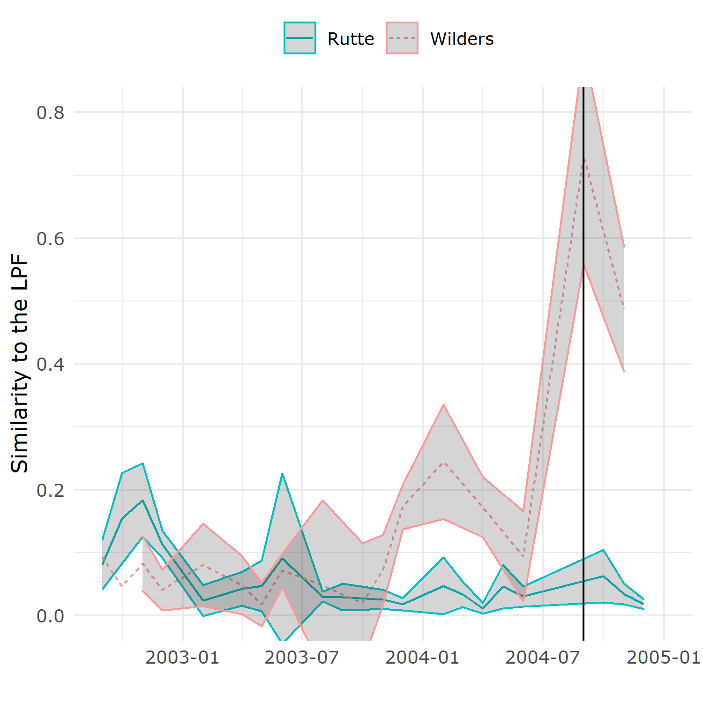

# SMLSE
Supervised Machine Learning Similarity Estimate

The project is concerned with the measurement of rhetorical similarity of texts through supervised machine learning (SMLSE). This site contains the reproducible code. A paper draft will soon be added.

Each country has its own folder, which contains the code for pre-processing, producing the SMLSE, and visualising the estimates. The German data contains additional files for classifier selection, wordfish estimation, estimation of cosine and jaccard similarity, and visualisation of these estimates. The NL-folder contains an additional file exploring Geert Wilders' rhetoric in 2004.