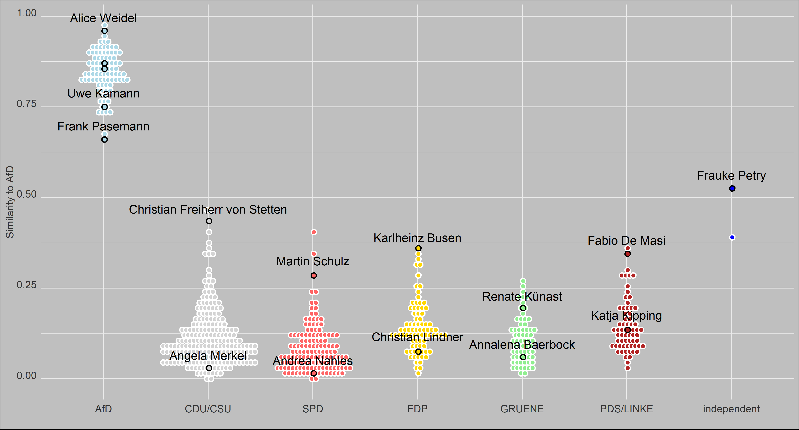

# SMLSE
## Supervised Machine Learning Similarity Estimate

The project is concerned with the measurement of rhetorical similarity of texts through supervised machine learning. This site contains the reproducible code and a draft paper. The data stems from the [ParlSpeech V2 data set](https://dataverse.harvard.edu/dataset.xhtml?persistentId=doi:10.7910/DVN/L4OAKN) developed by Christian Rauh and Jan Schwalbach (2020). The analyses should be fully reproducible, please open an issue if that is not the case.

Each country has its own folder, which contains the code for pre-processing, producing the estimates, and their visualisation. The German data contains additional files for classifier selection, wordfish estimation, estimation of cosine and jaccard similarity, and visualisation of these estimates. The NL-folder contains an additional file exploring Geert Wilders' rhetoric in 2004.

The plot below shows similarity to/distinctiveness of AfD-rhetoric for all speakers in the current German Bundestag.

### Resources

Rauh, Christian; Schwalbach, Jan, 2020, "The ParlSpeech V2 data set: Full-text corpora of 6.3 million parliamentary speeches in the key legislative chambers of nine representative democracies", https://doi.org/10.7910/DVN/L4OAKN, Harvard Dataverse, V1 
